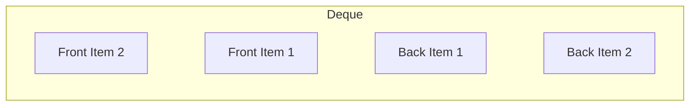

# Deque

## ELI5

A **deque** (double-ended queue) is like a train track where you can add or remove cars from both the front and back.



## When to use it

- **Browser History Navigation** – Move forward/backward in visited pages
- **Sliding Window Problems** – Fast access to both ends
- **Palindrome Checkers** – Compare both ends of a string efficiently
- **Job Scheduling** – Quickly add/remove high-priority tasks

## Example Usage

```go
package main

import (
  "fmt"
  "github.com/dudo/gods/pkg/deque"
)

func main() {
  dq := deque.New[string]()

  // Push elements to the front and back
  dq.PushFront("Front Item 1")
  dq.PushBack("Back Item 1")
  dq.PushFront("Front Item 2")
  dq.PushBack("Back Item 2")

  // Pop elements
  front, _ := dq.PopFront()
  back, _ := dq.PopBack()

  fmt.Println("Processing::", front)
  fmt.Println("Processing:", back)
}
```

Expected Output

```sh
Processing: Front Item 2
Processing: Back Item 2
```
