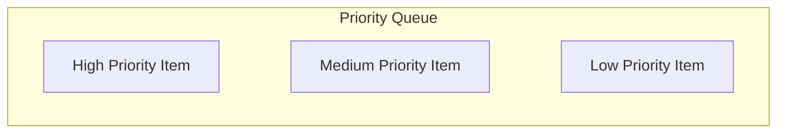

# Priority Queue

## ELI5

Imagine you’re in the emergency room. People don’t get called based on who arrived first (like a normal queue). Instead, the sickest patients get priority.

A **priority queue** lets you store items with a priority and always fetch the most important one first, based on a custom comparison function.



## When to use it

- **Task Scheduling** – Always execute the highest-priority task first
- **Pathfinding** Algorithms (Dijkstra’s) – Find the shortest path efficiently
- **Log Processing** – Merge logs based on timestamp (if using a Min-Heap)

## Example Usage

```go
package main

import (
  "fmt"
  "github.com/dudo/gods/pkg/priorityqueue"
)

func main() {
  pq := priorityqueue.New(func(a, b *priorityqueue.Item[string]) bool {
    return a.Priority < b.Priority // Min-Heap (smallest priority first)
  })

  // Insert tasks with different priorities (lower = higher priority)
  pq.PushItem("Low Priority Item", 5)
  pq.PushItem("High Priority Item", 1)
  pq.PushItem("Medium Priority Item", 3)

  // Process tasks in priority order
  for pq.Len() > 0 {
    item, _ := pq.PopItem()
    fmt.Println("Processing:", item)
  }
}
```

Expected Output

```sh
Processing: High Priority Item
Processing: Medium Priority Item
Processing: Low Priority Item
```
