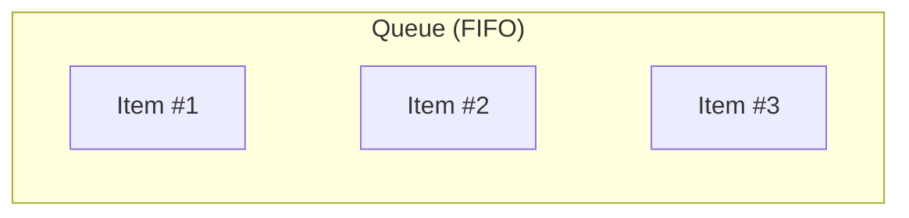

# Queue

## ELI5

A **queue** is like a line at a coffee shop.

- The first person in line gets served first.
- New people join at the back of the line.

This is called FIFO (First In, First Out).



## When to use it

- **Print Jobs** – First document sent prints first
- **Processing Requests** – Web servers handle requests in order
- **Message Queues (Kafka, RabbitMQ, SQS)** – Store tasks to process later

## Example Usage

```go
package main

import (
  "fmt"
  "github.com/dudo/gods/pkg/queue"
)

func main() {
  q := queue.New[string]()

  q.Enqueue("Item #1")
  q.Enqueue("Item #2")
  q.Enqueue("Item #3")

  for q.Len() > 0 {
    item, _ := q.Dequeue()
    fmt.Println("Processing:", item)
  }
}
```

Expected Output

```sh
Processing: Item #1
Processing: Item #2
Processing: Item #3
```
