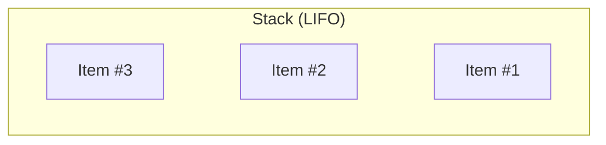

# Stack

## ELI5

A **stack** is like a pile of plates in a cafeteria.

- You add plates to the top (Push).
- You remove plates from the top (Pop).

This is called LIFO (Last In, First Out).



## When to use it

- **Undo/Redo** – Store previous actions in text editors
- **Backtracking Algorithms** – Depth-first search in a maze
- **Function Calls in Programming** – Used in recursion

## Example Usage

```go
package main

import (
  "fmt"
  "github.com/dudo/gods/pkg/stack"
)

func main() {
  s := stack.New[string]()

  s.Push("Item #1")
  s.Push("Item #2")
  s.Push("Item #3")

  for s.Len() > 0 {
    item, _ := s.Pop()
    fmt.Println("Processing:", item)
  }
}
```

Expected Output

```sh
Processing: Item #3
Processing: Item #2
Processing: Item #1
```
